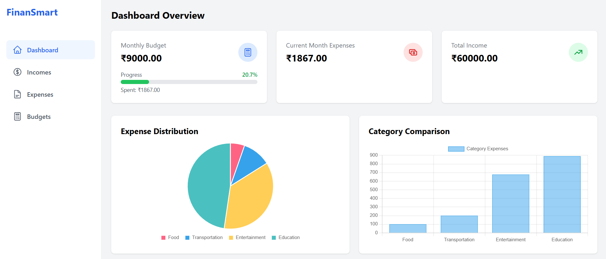

# FinanSmart - Personal Finance Tracker



FinanSmart is a modern, user-friendly personal finance tracking application built with React, Vite, and Tailwind CSS. It helps users manage their finances by tracking expenses, setting budgets, and visualizing spending patterns.

## 🌟 Features

- **Expense Tracking**: Easily log and categorize your daily expenses
- **Income Management**: Keep track of all your income sources
- **Budget Planning**: Set and monitor monthly budgets
- **Visual Analytics**: View your financial data through intuitive charts and graphs
- **Responsive Design**: Works seamlessly on desktop and mobile devices
- **Local Storage**: Your data stays private on your device
- **Real-time Updates**: See your financial status update instantly

## 🚀 Getting Started

### Prerequisites

- Node.js (v14 or higher)
- npm or yarn

### Installation

1. Clone the repository
```bash
git clone https://github.com/yourusername/finansmart.git
cd finansmart
```

2. Install dependencies
```bash
npm install
# or
yarn install
```

3. Start the development server
```bash
npm run dev
# or
yarn dev
```

4. Open your browser and visit `http://localhost:5173`

## 🛠️ Built With

- [React](https://reactjs.org/) - Frontend library
- [Vite](https://vitejs.dev/) - Build tool
- [Tailwind CSS](https://tailwindcss.com/) - Styling
- [Framer Motion](https://www.framer.com/motion/) - Animations
- [Chart.js](https://www.chartjs.org/) - Data visualization
- [React Router](https://reactrouter.com/) - Navigation

## 📁 Project Structure

```
src/
├── Components/         # Reusable UI components
├── pages/             # Main application pages
├── lib/               # Utility functions and helpers
└── assets/           # Static assets
```

## 🎯 Core Components

- **Dashboard**: Overview of financial status with key metrics
- **Expenses**: Track and manage expenses
- **Incomes**: Monitor income sources
- **Budgets**: Set and track budget goals

## 🔐 Privacy

All data is stored locally in your browser's localStorage. No data is sent to any external servers.

## ✨ Future Enhancements

- [ ] Dark/Light theme toggle
- [ ] Export data functionality
- [ ] Multiple currency support
- [ ] Recurring transactions
- [ ] Financial goals tracking
- [ ] Cloud sync option


